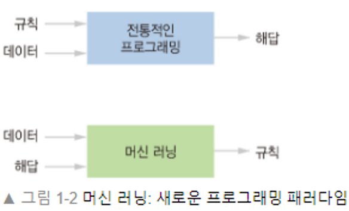
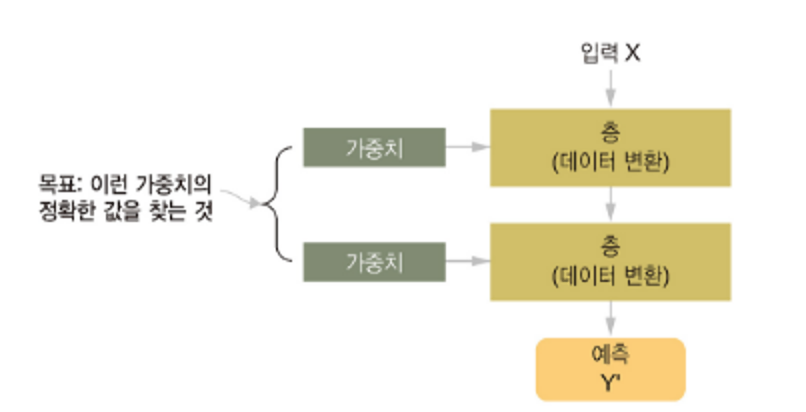
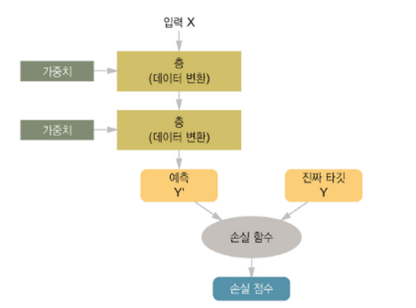
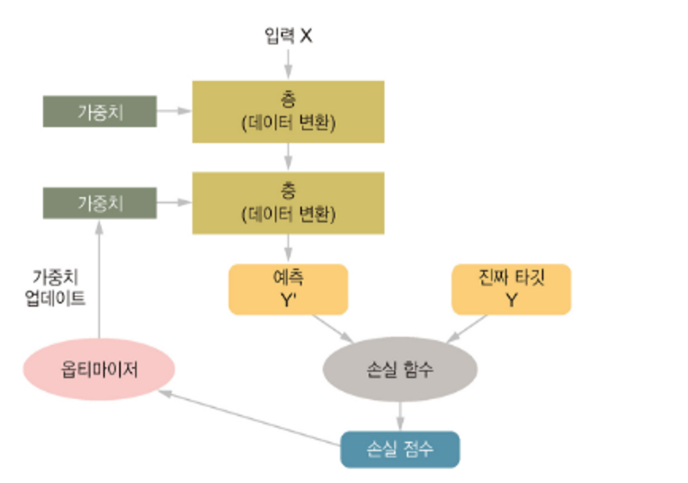

# Basic Deep Learning

참고 자료 : 

- [모두를 위한 딥러닝 시즌 2 -TensorFlow](<https://deeplearningzerotoall.github.io/season2/lec_tensorflow.html>)
- 케라스 창시자에게 배우는 딥러닝
- [TensorFlowKorea에서 한글 번역](https://tensorflowkorea.gitbooks.io/tensorflow-kr/content/)


데이터로부터 표현을 학습하는 수학 모델




- 샘플과 기댓값이 주어졌을 때 데이터 처리 작업을 위한 **실행 규칙을 찾는 것**, 

- 핵심문제는 **의미 있는 데이터로의 변환**


## 딥러닝이란?

그냥 데이터로부터 표현을 학습하는 수학 모델 (층+층+층+층…)


## 딥러닝 구성

```
네트워크(or 모델)를 구성하는 층
'입력 데이터'와 '타깃'
학습에 사용할 피드백 신호를 정의하는 손실 함수
학습 진행 방식을 결정하는 옵티마이저
```




- 목표 : 모든 층에 있는 가중치 값 찾기



- 손실함수(loss function) : 출력 품질 측정
  - 출력이 기대하는 것보다 얼마나 벗어났는지 측정



- 역전파(Backpropagation) : 손실 점수가 감소되는 방향으로 가중치 값 수정
  - 옵티마이저(optimizer) 가 담당


#### 층 : 딥러닝의 구성단위

N 텐서를 입력 받아 M 텐서 출력 하는 데이터 처리 모듈


#### 모델 : 층의 네트워크

가설 공간


#### 손실함수와 옵티마이저 : 학습 과정을 조절하는 열쇠


#### 텐서? 텐서연산?

- 텐서 : 축의 개수(랭크), 크기(shape), 데이터 타입의 3개 핵심 속성을 가진다.

```
from keras.datasets import mnist

(train_images, train_labels), (test_images, test_labels) = mnist.load_data()

train_images.ndim #축의 개수
train_images.shape #크기
train_images.dtype # 데이터타입
```


- 원소별 연산(element-wise operation)

```
z = x + y #원소별 덧셈 
z = np.maximum(z,0.) #원소별 렐루 함수
```

- 브로드캐스팅 : 연산을 위한 텐서 shape 맞추기

```
x = np.random.random((64,3,32,10))
y = np.random.random((32,10))
z = np.maximum(x,y) # z((64,3,32,10))
```

- 점곱 연산(dot operation) - tensor product

```
z = np.dot(x,y)
```

```
//행렬의 곱
A,B = M x N, N x P
AB = M x P
```

```
//고차원 텐서 간의 점곱
(a, b, c, d).(d,) -> (a, b, c)
(a, b, c, d).(d, e) -> (a, b, c, e)
```

- 텐서의 크기 변환(tensor reshaping)

```
x.shape #(3,2)
x.reshape((6,1))
x.transpose(x) #(1,6)
```


#### 케라스 딥러닝 간단한 예제보기

- [신경망의 첫만남-숫자분류](https://colab.research.google.com/github/bamssong/deep-learning-with-python-notebooks/blob/master/2.1-a-first-look-at-a-neural-network.ipynb)
- [이진분류-영화리뷰](https://colab.research.google.com/github/bamssong/deep-learning-with-python-notebooks/blob/master/3.4-classifying-movie-reviews.ipynb)
- [다중분류-뉴스카테고리](https://colab.research.google.com/github/bamssong/deep-learning-with-python-notebooks/blob/master/3.5-classifying-newswires.ipynb)
- [회귀문제-주택가격예측](https://colab.research.google.com/github/bamssong/deep-learning-with-python-notebooks/blob/master/3.6-predicting-house-prices.ipynb)


## 모모딥2 동영상 


### 시작과 XOR 문제

<iframe width="560" height="315" src="https://www.youtube.com/embed/n7DNueHGkqE" frameborder="0" allow="accelerometer; autoplay; encrypted-media; gyroscope; picture-in-picture" allowfullscreen></iframe>


#### 뉴럴 네트워크 형태


activation function 에서 임계치 값이 넘으면 1, 아니면 0 으로 표현 할 수 있다.


#### 문제 발생 - XOR  -> NN


XOR 문제 해결? 여러개의 layer를 합치기. 하지만 가중치 조절이 문제


#### 1차 문제 해결 - 역전파(Backpropagation)


### Back-propagation과 2006/2007 ‘딥’의 출현

<iframe width="560" height="315" src="https://www.youtube.com/embed/AByVbUX1PUI" frameborder="0" allow="accelerometer; autoplay; encrypted-media; gyroscope; picture-in-picture" allowfullscreen></iframe>

#### 문제 완전(?) 해결 - 데이터 전처리가 중요하다


초기값을 잘 주면, 딥러닝이 가능하다.


### XOR 문제 딥러닝으로 풀기

<iframe width="560" height="315" src="https://www.youtube.com/embed/GYecDQQwTdI" frameborder="0" allow="accelerometer; autoplay; encrypted-media; gyroscope; picture-in-picture" allowfullscreen></iframe>

#### 뉴럴 네트워크(NN)


여러개의 모델합치면 가능하다 


#### 구성


### 딥넷트웍 학습 시키기 (backpropagation)

<iframe width="560" height="315" src="https://www.youtube.com/embed/573EZkzfnZ0" frameborder="0" allow="accelerometer; autoplay; encrypted-media; gyroscope; picture-in-picture" allowfullscreen></iframe>

Gradient Descent 알고리즘을 통해서 학습

forward/backward


### Neural Net for XOR

<iframe width="560" height="315" src="https://www.youtube.com/embed/TX8ZYHexfBg" frameborder="0" allow="accelerometer; autoplay; encrypted-media; gyroscope; picture-in-picture" allowfullscreen></iframe>

[코드보기](https://colab.research.google.com/github/bamssong/TensorFlow/blob/master/code_session_version/lab-09-1-XOR-session.ipynb)


### Tensorboard (Neural Net for XOR)

<iframe width="560" height="315" src="https://www.youtube.com/embed/TlYkJlSEK5w" frameborder="0" allow="accelerometer; autoplay; encrypted-media; gyroscope; picture-in-picture" allowfullscreen></iframe>


###  Sigmoid 보다 ReLU가 더 좋아

<iframe width="560" height="315" src="https://www.youtube.com/embed/pAFnPKFHvqE" frameborder="0" allow="accelerometer; autoplay; encrypted-media; gyroscope; picture-in-picture" allowfullscreen></iframe>


###  Weight 초기화 잘해보자

<iframe width="560" height="315" src="https://www.youtube.com/embed/T2AjQ3xKp-0" frameborder="0" allow="accelerometer; autoplay; encrypted-media; gyroscope; picture-in-picture" allowfullscreen></iframe>


### Dropout

<iframe width="560" height="315" src="https://www.youtube.com/embed/U2wT7jVJ8Xk" frameborder="0" allow="accelerometer; autoplay; encrypted-media; gyroscope; picture-in-picture" allowfullscreen></iframe>


### Batch Normalization

<iframe width="560" height="315" src="https://www.youtube.com/embed/-VwtLBp2FRs" frameborder="0" allow="accelerometer; autoplay; encrypted-media; gyroscope; picture-in-picture" allowfullscreen></iframe>


## 용어정리

학습(Learning) : 더 나은 표현을 찾는 자동화된 과정

Deep : 연속된 층으로 표현을 학습한다는 개념

과대적합(overfitting) : 훈련 데이터보다 새로운 데이터에서 성능이 낮아지는 경향

스칼라(0D)

벡터(1D)

행렬(2D)

고차원(3D)

